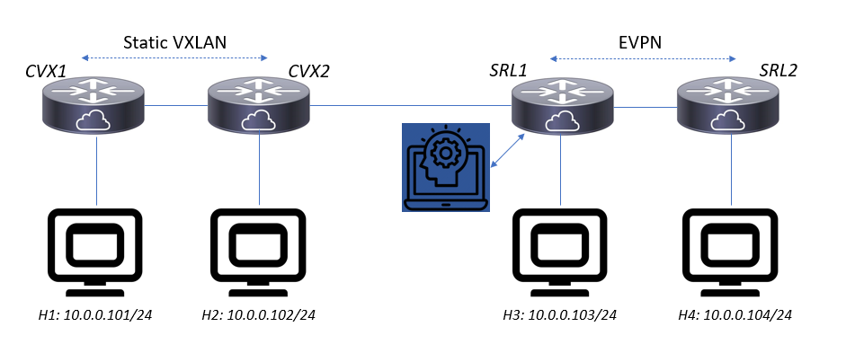
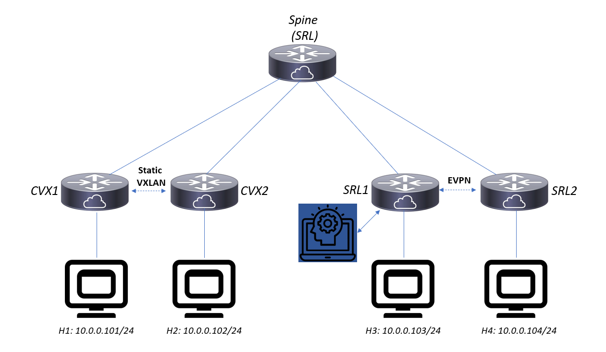

# VXLAN data plane learning using eBPF: Using SR Linux as an EVPN proxy
Some traditional data center designs lack an EVPN control plane, but we can extend SRL to function as a proxy while transitioning to a fully dynamic EVPN fabric


# Introduction
Most data center designs start small before they evolve. At small scale, it may make sense to manually configure static VXLAN tunnels between leaf switches, as illustrated [here](https://docs.nvidia.com/networking-ethernet-software/cumulus-linux-41/Network-Virtualization/Static-VXLAN-Tunnels/) and implemented on the 2 virtual lab nodes on the left side. There is nothing wrong with such an initial design, but as the fabric grows and the number of leaves reaches a certain threshold, having to touch every switch each time a device is added can get cumbersome and error prone.

The internet and most modern large scale data center designs use dynamic control plane protocols and volatile in-memory configuration to configure packet forwarding. BGP is a popular choice, and the Ethernet VPN address family (EVPN [RFC8365](https://datatracker.ietf.org/doc/html/rfc8365)) can support both L2 and L3 overlay services. However, legacy fabrics continue to support business critical applications, and there is a desire to keep doing so without service interruptions, and with minimal changes. So how can we move to the new dynamic world of EVPN based data center fabrics, while transitioning gradually and smoothly from these static configurations?

## Option 1: SRL nodes as EVPN proxies
By configuring an SRL node with the same VTEP tunnel IP and announcing a type 3 EVPN multicast route, we can send return traffic to static VXLAN endpoints.
However, as there is no data plane MAC learning, all MACs residing on such endpoints are effectively "unknown" as far as SRL is concerned, hence every packet to such MACs gets flooded to every VTEP in the fabric. Not very elegant nor practical.

# Solution: Implement an EVPN proxy agent
By adding a BGP speaker application to an SR Linux node, we can advertise EVPN routes on behalf of legacy VTEP devices with static configuration. Furthermore, by observing datapath VXLAN traffic from such nodes, we can dynamically discover MAC addresses and VTEP endpoint IPs.

This Github repo implements such an approach, using the following components:
* The [Ryu BGP speaker library](https://ryu.readthedocs.io/en/latest/library_bgp_speaker_ref.html) and [packet parsing classes](https://ryu.readthedocs.io/en/latest/library_packet.html)
* Google gRPC framework, [modified to support eventlet](https://github.com/jbemmel/grpc) (used by Ryu)
* VXLAN ARP snooping using [Extended Berkeley Packet Filters(eBPF)](https://prototype-kernel.readthedocs.io/en/latest/bpf/) filters

## Step 1: Adding an eBPF based VXLAN packet filter to capture ARP packets
The idea is to create an eBPF program to filter out VXLAN packets on a given fabric interface inside the srbase network instance (associated with a MAC VRF (L2) or an IP VRF (L3) overlay service). The filter program selects only VXLAN packets (UDP port 4789) containing ARP packets (requests or responses).

```Python
Rx( packet ) {
if (packet==VXLAN) && (packet.inner == ARP) {
  forward to Python userspace program
}
```

## Step 2: Send out EVPN routes (multicast, RT2 for each MAC/IP) on behalf of static VTEPs
The Python userspace program receives filtered VXLAN ARP packets and uses BGP EVPN to advertise a route (type 2 for MAC-VRF, type 5 for IP-VRF[TODO]) to the fabric (locally or towards a route reflector). It participates in the EVPN fabric and only advertises routes for VTEPs that are not sending EVPN routes themselves.

As it was found that Ryu implicitly assumes the sending endpoint is also the tunnel endpoint, [some minor changes](https://github.com/jbemmel/srl-evpn-proxy/tree/main/ryu_enhancements) had to be made to allow for arbitrary tunnel endpoint IPs in multicast routes.

# Lab prototype demo
Using [Containerlab](https://containerlab.srlinux.dev/), the following topology can be deployed:


```
git clone & make https://github.com/jbemmel/containerlab.git to get a customized containerlab binary with agent support
git clone & make https://github.com/jbemmel/srl-baseimage
make # to build the custom 'srl/evpn-proxy-agent' Docker container
cd labs/spine-leaf && sudo containerlab deploy -t static-vxlan-with-spine.lab
```
All VXLAN traffic is forwarded via a single spine.
Out of the box, the EVPN proxy agent is disabled; h1 can ping h2 and h3 can ping h4 (after giving the nodes enough time to boot):

```
jeroen@bembox:~/srlinux/srl-evpn-proxy$ docker exec -it clab-static-vxlan-spine-lab-h1 ping 10.0.0.102 -c2
PING 10.0.0.102 (10.0.0.102) 56(84) bytes of data.
64 bytes from 10.0.0.102: icmp_seq=1 ttl=64 time=2.35 ms
64 bytes from 10.0.0.102: icmp_seq=2 ttl=64 time=6.27 ms

--- 10.0.0.102 ping statistics ---
2 packets transmitted, 2 received, 0% packet loss, time 2ms
rtt min/avg/max/mdev = 2.351/4.312/6.274/1.962 ms
jeroen@bembox:~/srlinux/srl-evpn-proxy$ docker exec -it clab-static-vxlan-spine-lab-h3 ping 10.0.0.104 -c2
PING 10.0.0.104 (10.0.0.104) 56(84) bytes of data.
64 bytes from 10.0.0.104: icmp_seq=1 ttl=64 time=0.975 ms
64 bytes from 10.0.0.104: icmp_seq=2 ttl=64 time=0.958 ms

--- 10.0.0.104 ping statistics ---
2 packets transmitted, 2 received, 0% packet loss, time 2ms
rtt min/avg/max/mdev = 0.958/0.966/0.975/0.032 ms

# Cannot ping from static to EVPN VTEP
jeroen@bembox:~/srlinux/srl-evpn-proxy$ docker exec -it clab-static-vxlan-spine-lab-h1 ping 10.0.0.103 -c2
PING 10.0.0.103 (10.0.0.103) 56(84) bytes of data.
From 10.0.0.101 icmp_seq=1 Destination Host Unreachable
From 10.0.0.101 icmp_seq=2 Destination Host Unreachable

--- 10.0.0.103 ping statistics ---
2 packets transmitted, 0 received, +2 errors, 100% packet loss, time 15ms
pipe 2
```

The EVPN VTEPs [have been added to the static configuration](https://github.com/jbemmel/srl-evpn-proxy/blob/main/labs/spine-leaf/cumulus1_interfaces#L42) and static underlay routes make them reachable, however return traffic gets dropped on the SRL nodes as there is no valid route.

We can enable the EVPN proxy on SRL1 (or SRL2, or both):
```
enter candidate
/network-instance default protocols 
bgp {
  group leaves {
    route-reflector {
      client true
      cluster-id ${/network-instance[name=default]/protocols/bgp/router-id}
    }
  }
  neighbor ${/interface[name=lo0]/subinterface[index=0]/ipv4/address/ip-prefix|_.split('/')[0]} {
    description "Local EVPN proxy agent"
    admin-state enable
    peer-group leaves
  }
  trace-options {
     flag packets {
         modifier detail
     }
     flag update {
         modifier detail
     }
  }
}
experimental-bgp-evpn-proxy
  local-as 65000
  peer-as 65000
  source-address ${/interface[name=lo0]/subinterface[index=0]/ipv4/address/ip-prefix|_.split('/')[0]}
  vxlan-interface e1-1
  vnis [ ${/tunnel-interface[name=vxlan0]/vxlan-interface[index=0]/ingress/vni} ]
  vxlan-remoteips [ 1.1.1.1 ]
  evi 57069
  admin-state enable

/network-instance mac-vrf-evi10 protocols bgp-evpn bgp-instance 1 proxy true

commit stay
```
This configures the local SRL node to be a route reflector too, such that it will update other EVPN VTEPs with any proxy routes. If we now retry the ping:
```
commit stay                                                                                                                                                                                                        
Lookup state path=${/tunnel-interface[name=vxlan0]/vxlan-interface[index=0]/ingress/vni} _root=/tunnel-interface[name=vxlan0]/vxlan-interface[index=0]/ingress parts=['', 'tunnel-interface[name=vxlan0]', 'vxlan-interface[index=0]', 'ingress', 'vni']
root=/tunnel-interface[name=vxlan0]/vxlan-interface[index=0]/ingress leaf=vni -> 11189196 type=<class 'int'>
All changes have been committed. Starting new transaction.
--{ + candidate shared default }--[ network-instance default protocols experimental-bgp-evpn-proxy ]--                                                                                                             
A:srl1# quit                                                                                                                                                                                                       
Connection to clab-static-vxlan-spine-lab-srl1 closed.
jeroen@bembox:~/srlinux/srl-evpn-proxy$ docker exec -it clab-static-vxlan-spine-lab-h1 ping 10.0.0.103 -c2
PING 10.0.0.103 (10.0.0.103) 56(84) bytes of data.
64 bytes from 10.0.0.103: icmp_seq=1 ttl=64 time=1038 ms
64 bytes from 10.0.0.103: icmp_seq=2 ttl=64 time=5.96 ms

--- 10.0.0.103 ping statistics ---
2 packets transmitted, 2 received, 0% packet loss, time 33ms
rtt min/avg/max/mdev = 5.960/521.770/1037.581/515.811 ms, pipe 2
```

Looking at the EVPN routes received from the custom proxy application:
```
jeroen@bembox:~/srlinux/srl-evpn-proxy$ ssh admin@clab-static-vxlan-spine-lab-srl1
Warning: Permanently added 'clab-static-vxlan-lab-srl1,2001:172:20:20::3' (ECDSA) to the list of known hosts.
Last login: Tue Aug 24 22:04:55 2021 from 2001:172:20:20::1
Using configuration file(s): ['/home/admin/.srlinuxrc']
Welcome to the srlinux CLI.
Type 'help' (and press <ENTER>) if you need any help using this.
--{ + running }--[  ]--                                                                                                                                                                                            
A:srl1# show network-instance default protocols bgp neighbor 1.1.1.4 received-routes evpn                                                                                                                          
-------------------------------------------------------------------------------------------------------------------------------------------------------------------------------------------------------------------
Peer        : 1.1.1.4, remote AS: 65000, local AS: 65000
Type        : static
Description : None
Group       : leaves
-------------------------------------------------------------------------------------------------------------------------------------------------------------------------------------------------------------------
Status codes: u=used, *=valid, >=best, x=stale
Origin codes: i=IGP, e=EGP, ?=incomplete
-------------------------------------------------------------------------------------------------------------------------------------------------------------------------------------------------------------------
Type 2 MAC-IP Advertisement Routes
+--------+------------------------------+------------+-------------------+------------------------------+------------------------------+------------------------------+---------+------------------------------+
| Status |     Route-distinguisher      |   Tag-ID   |    MAC-address    |          IP-address          |           Next-Hop           |             MED              | LocPref |             Path             |
+========+==============================+============+===================+==============================+==============================+==============================+=========+==============================+
| u*>    | 1.1.1.1:57069                | 0          | AA:C1:AB:CC:3B:AD | 10.0.0.101                   | 1.1.1.1                      | -                            | 100     |                              |
+--------+------------------------------+------------+-------------------+------------------------------+------------------------------+------------------------------+---------+------------------------------+
-------------------------------------------------------------------------------------------------------------------------------------------------------------------------------------------------------------------
Type 3 Inclusive Multicast Ethernet Tag Routes
+--------+--------------------------------------+------------+---------------------+--------------------------------------+--------------------------------------+---------+--------------------------------------+
| Status |         Route-distinguisher          |   Tag-ID   |    Originator-IP    |               Next-Hop               |                 MED                  | LocPref |                 Path                 |
+========+======================================+============+=====================+======================================+======================================+=========+======================================+
| u*>    | 1.1.1.1:57069                        | 0          | 1.1.1.1             | 1.1.1.1                              | -                                    | 100     |                                      |
+--------+--------------------------------------+------------+---------------------+--------------------------------------+--------------------------------------+---------+--------------------------------------+
-------------------------------------------------------------------------------------------------------------------------------------------------------------------------------------------------------------------
0 Ethernet Auto-Discovery routes 0 used, 0 valid
1 MAC-IP Advertisement routes 1 used, 1 valid
1 Inclusive Multicast Ethernet Tag routes 1 used, 1 valid
0 Ethernet Segment routes 0 used, 0 valid
0 IP Prefix routes 0 used, 0 valid
-------------------------------------------------------------------------------------------------------------------------------------------------------------------------------------------------------------------
```
In the log file at /var/log/srlinux/stdout/srl_evpn_proxy.log we see:
```
...
22:05:10,606 root INFO ARP packet:ethernet=ethernet(dst='02:6a:2c:ff:00:02',ethertype=2048,src='aa:c1:ab:68:e1:e8')
22:05:10,607 root INFO ARP packet:ipv4=ipv4(csum=44804,dst='1.1.1.5',flags=0,header_length=5,identification=51347,offset=0,option=None,proto=17,src='1.1.1.1',tos=0,total_length=78,ttl=63,version=4)
22:05:10,608 root INFO ARP packet:udp=udp(csum=32319,dst_port=4789,src_port=40050,total_length=58)
22:05:10,608 root INFO ARP packet:vxlan=vxlan(vni=11189196)
22:05:10,608 root INFO vni = 11189196
22:05:10,608 root INFO ARP packet:ethernet=ethernet(dst='ff:ff:ff:ff:ff:ff',ethertype=2054,src='aa:c1:ab:cc:3b:ad')
22:05:10,608 root INFO ARP packet:arp=arp(dst_ip='10.0.0.103',dst_mac='00:00:00:00:00:00',hlen=6,hwtype=1,opcode=1,plen=4,proto=2048,src_ip='10.0.0.101',src_mac='aa:c1:ab:cc:3b:ad')
22:05:10,609 root INFO ARP request from static VTEP: aa:c1:ab:cc:3b:ad 10.0.0.101
22:05:10,609 root INFO Adding VRF...RD=1.1.1.1:57069 RT=65000:57069
22:05:10,609 bgpspeaker.api.base INFO API method vrf.create called with args: {'route_dist': '1.1.1.1:57069', 'import_rts': ['65000:57069'], 'export_rts': ['65000:57069'], 'site_of_origins': None, 'route_family': 'evpn', 'multi_exit_disc': None}
22:05:10,616 root INFO Adding EVPN multicast route...
22:05:10,616 bgpspeaker.api.base INFO API method evpn_prefix.add_local called with args: {'route_type': 'multicast_etag', 'route_dist': '1.1.1.1:57069', 'next_hop': '1.1.1.1', 'tunnel_type': 'vxlan', 'ethernet_tag_id': 0, 'ip_addr': '1.1.1.1', 'vni': 11189196, 'pmsi_tunnel_type': 6, 'tunnel_endpoint_ip': '1.1.1.1'}
22:05:10,617 root INFO Announcing EVPN MAC route...evpn_vteps={'1.1.1.5': 65000, '1.1.1.7': 65000}
22:05:10,617 bgpspeaker.api.base INFO API method evpn_prefix.add_local called with args: {'route_type': 'mac_ip_adv', 'route_dist': '1.1.1.1:57069', 'next_hop': '1.1.1.1', 'tunnel_type': 'vxlan', 'esi': 0, 'ethernet_tag_id': 0, 'mac_addr': 'aa:c1:ab:cc:3b:ad', 'ip_addr': '10.0.0.101', 'vni': 11189196}
```
Meaning SRL1 received an ARP request sent by static VTEP 1.1.1.1 (CVX1), the VNI matches the configured proxy value and the MAC/IP pair is advertised as a RT2. Q.E.D.

Once SRL1 learns a MAC/IP route, it sends it to SRL2 such that a ping from H1 to H4 should now work too:
```
jeroen@bembox:~/srlinux/srl-evpn-proxy$ docker exec -it clab-static-vxlan-lab-h1 ping 10.0.0.104 -c2
PING 10.0.0.104 (10.0.0.104) 56(84) bytes of data.
64 bytes from 10.0.0.104: icmp_seq=1 ttl=64 time=34.9 ms
64 bytes from 10.0.0.104: icmp_seq=2 ttl=64 time=2.39 ms

--- 10.0.0.104 ping statistics ---
2 packets transmitted, 2 received, 0% packet loss, time 2ms
rtt min/avg/max/mdev = 2.393/18.640/34.888/16.248 ms
```

In case a host first tries to reach H4 without trying H3, the datapath will not work; a multicast route must first be established. Without a specific MAC/IP route, traffic will still get flooded until the proxy on SRL1 learns the correct VTEP:
```
jeroen@bembox:~/srlinux/srl-evpn-proxy$ docker exec -it clab-static-vxlan-spine-lab-h2 ping 10.0.0.104 -c2
PING 10.0.0.104 (10.0.0.104) 56(84) bytes of data.
64 bytes from 10.0.0.104: icmp_seq=1 ttl=64 time=2068 ms
64 bytes from 10.0.0.104: icmp_seq=2 ttl=64 time=1043 ms

--- 10.0.0.104 ping statistics ---
2 packets transmitted, 2 received, 0% packet loss, time 26ms
rtt min/avg/max/mdev = 1042.896/1555.218/2067.540/512.322 ms, pipe 2
jeroen@bembox:~/srlinux/srl-evpn-proxy$ docker exec -it clab-static-vxlan-spine-lab-h2 ping 10.0.0.103 -c1
PING 10.0.0.103 (10.0.0.103) 56(84) bytes of data.
64 bytes from 10.0.0.103: icmp_seq=1 ttl=64 time=2.31 ms

--- 10.0.0.103 ping statistics ---
1 packets transmitted, 1 received, 0% packet loss, time 0ms
rtt min/avg/max/mdev = 2.306/2.306/2.306/0.000 ms
jeroen@bembox:~/srlinux/srl-evpn-proxy$ docker exec -it clab-static-vxlan-spine-lab-h2 ping 10.0.0.104 -c2
PING 10.0.0.104 (10.0.0.104) 56(84) bytes of data.
64 bytes from 10.0.0.104: icmp_seq=1 ttl=64 time=3.24 ms
64 bytes from 10.0.0.104: icmp_seq=2 ttl=64 time=2.63 ms

--- 10.0.0.104 ping statistics ---
2 packets transmitted, 2 received, 0% packet loss, time 2ms
rtt min/avg/max/mdev = 2.633/2.935/3.238/0.307 ms
```
This could be avoided by running the EVPN proxy on every SRL node.

## TODO
* EVPN proxy requires VXLAN traffic to be sent to the SRL node, and hence should only be provisioned for mac-vrfs with bgp-evpn that are configured (not arbitrary VNIDs). The YANG model hooks are added (proxy=true), but currently not used; a specific EVI and VNID list must be configured instead.
* eBPF ARP filter could reduce packets sent to userspace by implementing a hashmap of ARPs already forwarded; the Python userspace could program a list of EVPN VTEPs to ignore

# EVPN MAC Mobility
EVPN MAC Mobility procedures are defined in [RFC7432](https://datatracker.ietf.org/doc/html/rfc7432#section-7.7) and amount to adding a sequence number extended community to RT2 updates. Ryu supports the parsing and generation of these attributes, but the code currently does not use them; a patch was created to change that.

## EVPN MAC Mobility in case of multiple proxies
For redundancy, multiple proxies can be instantiated, and any one of them can assume responsibility for announcing EVPN MAC IP routes as they are discovered. Each proxy will listen for RT2 updates from other proxies, and if an announcement for a MAC with a different VTEP is received with a higher sequence number, the proxy will withdraw its own route.

## Testing MAC Mobility
We can test MAC mobility by swapping the MACs of H1 and H2, and then ping from H2 to H3:
```bash
cat > test_mac_move.sh << EOF
MAC1=\`docker exec -it clab-static-vxlan-spine-lab-h1 ip a show dev eth1 | awk '/ether/{ print \$2 }' | head -1\`
MAC2=\`docker exec -it clab-static-vxlan-spine-lab-h2 ip a show dev eth1 | awk '/ether/{ print \$2 }' | head -1\`
docker exec -it clab-static-vxlan-spine-lab-h1 ip link set address \$MAC2 dev eth1
docker exec -it clab-static-vxlan-spine-lab-h2 ip link set address \$MAC1 dev eth1
docker exec -it clab-static-vxlan-spine-lab-h2 ping 10.0.0.103 -c2
EOF
chmod +x ./test_mac_move.sh 
bash -c ./test_mac_move.sh
```

Similarly, we can move the MAC to EVPN (H4 attached to SRL2) and repeat the test:
```
docker exec -it clab-static-vxlan-spine-lab-h4 ip link set address $MAC dev eth1
docker exec -it clab-static-vxlan-spine-lab-h4 ping 10.0.0.103 -c2
```

## A note on sFlow sampling
On physical SRL nodes, sFlow sampling could be used to learn MAC/IP routes, instead of eBPF filters. If required and over time, the sampling frequency could be reduced, or a target could be set on the number of VTEPs to discover before transitioning to a forwarding-only mode

## Other options considered
I looked into attaching to the loopback TCP connection between the datapath (sr_xdp_lc_1) and the ARP/ND manager process (sr_arp_nd_mgr); there are 3 connections, and one of them received a packet containing the ARP request from a host. However, as neither the VTEP IP nor the VXLAN VNID are available in this message, there appears to be no easy way to associate the source MAC from these ARP packets with the correct service.

I tried attaching an XDP program to e1-2 (with BPF_PERF_OUTPUT events to communicate with userspace containing the VNID, VTEP IP(v4), source MAC and source IP), but Linux returns a permission denied error

One could use TC ingress/egress filters to distinguish various cases; the raw socket receives both incoming and outgoing VXLAN packets. It may be possible to determine this from the [sk_buff](https://github.com/torvalds/linux/blob/master/include/uapi/linux/bpf.h#L5146) struct.

As an optimization, I considered using a "map of maps" (BPF_MAP_TYPE_HASH_OF_MAPS) to lookup the LRU MAC table for the given VNID. If the MAC is found, the packet is dropped.
However, ARP packets are rare enough to not represent a large burden on the CPU, and a simple VXLAN ARP filter is easier to program.

I tried collecting sFlow samples, but the SR Linux container image only seems to send counter samples, not packet samples.

# Sources used

* [Using map-in-map in BPF programs](https://hechao.li/2019/03/19/Use-Map-in-Map-in-BPF-programs-via-Libbpf/)
* [How to send perf events to Python userspace](https://github.com/iovisor/bcc/blob/master/docs/tutorial_bcc_python_developer.md#lesson-7-hello_perf_outputpy)
* [Processing VXLAN packets in BPF](https://github.com/iovisor/bcc/tree/master/examples/networking/tunnel_monitor)
* [Ryu packet parsing](https://ryu.readthedocs.io/en/latest/library_packet.html)

# Issues encountered
* gRPC and eventlet don't play nicely together, see https://github.com/grpc/grpc/issues/15923 ; 2020 [patch available](https://github.com/Akrog/grpc/blob/eventlet/src/python/grpcio/grpc/experimental/eventlet.py) and [merged with master](https://github.com/jbemmel/grpc)
* gRPC parallel builds obfuscate compiler errors; [use](https://github.com/jbemmel/srl-evpn-proxy/blob/main/Dockerfile#L30) 'GRPC_PYTHON_BUILD_EXT_COMPILER_JOBS=1' to build serially
* Network namespaces can be tricky to work with in Python
