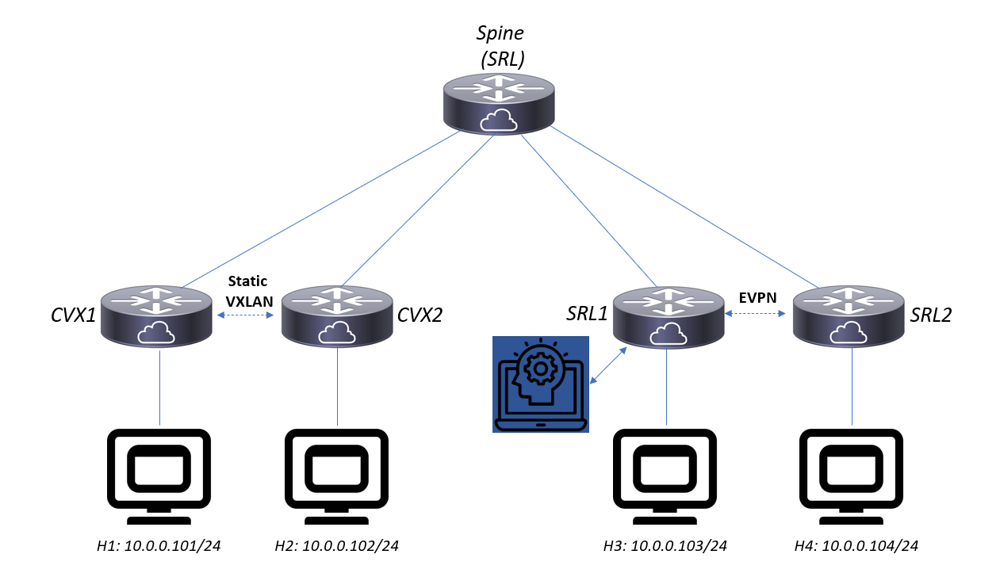

# VXLAN Agent demo scenario

## Installation
```
bash -c "$(curl -sL https://get-clab.srlinux.dev)" # install Containerlab, version 0.18 or higher
git clone & make https://github.com/jbemmel/srl-baseimage
make # to build the custom 'srl/evpn-proxy-agent' Docker container
cd labs/spine-leaf && sudo containerlab deploy -t static-vxlan-with-spine.lab
```

This results in a setup containing 2 Cumulus nodes with static VXLAN configuration, and 2 SR Linux nodes with dynamic EVPN VXLAN.
H1 (on Cumulus1) can ping H2 (on Cumulus2) and H3(on SRL1) can ping H4(on SRL2), but no other flows work.
